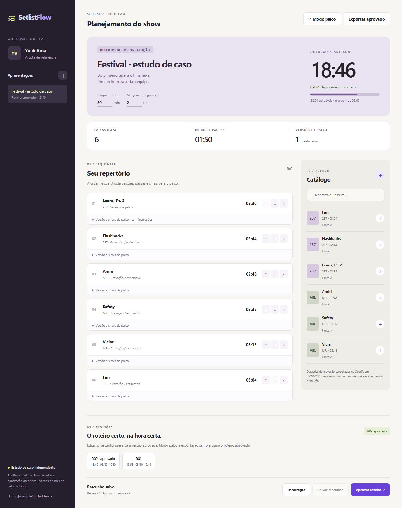
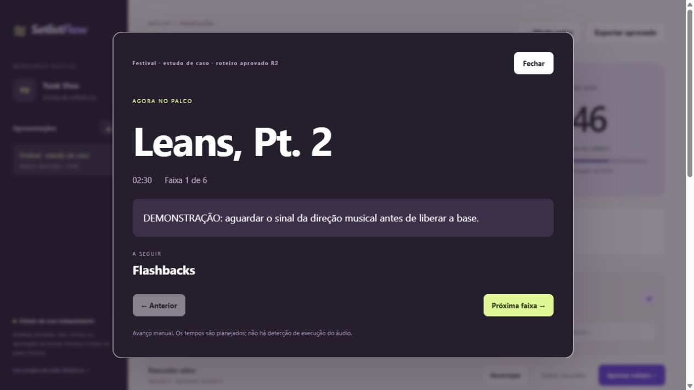

# SetlistFlow

[](https://github.com/jmmedeiross/setlistflow/actions/workflows/ci.yml)

Planejamento de shows com cálculo de duração, versões de palco e roteiros aprovados. Construído em **C# / ASP.NET Core, SQLite e JavaScript**, com 29 verificações automatizadas de domínio, integração e navegador.

**Estudo de caso independente:** Yunk Vino é o artista de referência do catálogo demonstrativo. O briefing é simulado; não houve solicitação, contratação, parceria ou aprovação do artista ou da equipe. Eventos e instruções de palco são fictícios. O projeto não distribui áudios, letras, fotografias ou capas.



## O problema e a solução

Uma playlist contém gravações; um show também inclui cortes, intros, falas, pausas e sinais para a equipe. O SetlistFlow modela esses elementos e calcula o tempo utilizável, descontando a margem de segurança. Um roteiro que excede o limite não pode ser aprovado.

Depois da aprovação, editar o rascunho cria outra revisão sem alterar o roteiro usado no modo palco. Duas edições baseadas na mesma versão não se sobrescrevem: a segunda recebe um conflito e mantém seu rascunho na tela.

## Funcionalidades implementadas

- Catálogo inicial com seis faixas, fonte e duração de gravação; cadastro de novas faixas.
- Criação de apresentações, adição/remoção e reordenação de entradas por controles acessíveis.
- Duração ao vivo opcional, intros, pausas, energia manual e sinais para a equipe.
- Cálculo imediato na interface e validação independente no servidor.
- Histórico persistente de revisões, aprovação e snapshots preservados.
- Modo palco com faixa atual, próxima faixa e avanço manual.
- Exportação do roteiro aprovado pela impressão do navegador, incluindo salvar como PDF.
- Banco SQLite, transações e controle de concorrência por versão.
- Modo público de consulta, ativado por configuração.
- CI com testes de domínio, API, SQLite e validação de sintaxe JavaScript.



## Executar

Requer **.NET SDK 10**. A aplicação não exige chaves ou cadastro em serviços musicais.

```sh
dotnet run --project src/SetlistFlow.Api --urls http://localhost:5187
```

Abra http://localhost:5187. O banco é criado em `src/SetlistFlow.Api/data/`, fora do versionamento. A primeira execução prepara um repertório fictício de 30 minutos, com dois minutos de margem.

Variáveis opcionais:

| Variável | Função |
|---|---|
| `SETLISTFLOW_DB` | Caminho do banco SQLite |
| `SETLISTFLOW_READ_ONLY=true` | Desativa operações de escrita; em um banco novo, o roteiro demonstrativo inicial é aprovado para consulta |
| `ASPNETCORE_URLS` | Endereço de escuta da aplicação |

## Testar

```sh
dotnet build src/SetlistFlow.Api -c Release
dotnet run --project tests/SetlistFlow.Tests -c Release
python tests/integration.py
node --check src/SetlistFlow.Api/wwwroot/app.js
npm ci --ignore-scripts
npx playwright install chromium
npm run test:e2e
```

O executável de testes de domínio usa asserções em C# e retorna código de erro se alguma falhar. São **14 cenários de domínio**. O Python usa apenas a biblioteca padrão e executa **9 testes de integração** contra uma instância temporária da API e um banco temporário. Nenhum teste chama o Spotify ou outros serviços externos.

Seis testes com Playwright verificam os fluxos de navegador, incluindo conflitos entre duas sessões, snapshots aprovados, reordenação, geração de PDF e demonstração de consulta em um viewport de celular. As instâncias usam bancos temporários e não acessam perfis ou sessões pessoais. O CI publica relatórios, rastros de falha e o PDF gerado como artefatos. Veja [plano e evidências de qualidade](docs/QUALITY.md).

## Docker

```sh
docker build -t setlistflow .
docker run --rm -p 5187:8080 -v setlistflow-data:/data setlistflow
```

Para uma demonstração pública de consulta em um banco novo:

```sh
docker run --rm -p 5187:8080 -e SETLISTFLOW_READ_ONLY=true -v setlistflow-demo:/data setlistflow
```

O Dockerfile é utilizado para a demonstração no Render. A configuração está em `render.yaml`: plano Free, endpoint de saúde `/api/health` e modo de consulta. Em hospedagem, a variável `PORT` define a porta de escuta. O banco da demonstração tem dados fictícios e pode ser recriado quando o serviço reinicia; não exige disco pago.

## Regras demonstráveis

As seis gravações somam **17:18**; cinco pausas de 20 segundos produzem **18:58**. Em um show de 20 minutos com margem de dois minutos, o roteiro excede os 18 minutos utilizáveis em **0:58** e não pode ser aprovado.

Duração de gravação não equivale automaticamente à duração ao vivo. Quando o campo ao vivo está vazio, o sistema informa que o cálculo usa uma estimativa. Pausas após a última faixa também contam quando preenchidas. Não há sobreposição automática ou análise de áudio.

## Estrutura

```text
src/SetlistFlow.Core/       Regras de duração e aprovação
src/SetlistFlow.Api/        HTTP, SQLite e interface web
tests/SetlistFlow.Tests/    Cenários de domínio em C#
tests/integration.py       Fluxos HTTP e persistência
docs/                      Briefing, decisões, API e qualidade
```

Veja [contrato HTTP](docs/API.md), [decisões de arquitetura](docs/DECISIONS.md) e [briefing simulado](docs/BRIEFING.md).

## Escopo e limites

Esta versão é um workspace local, sem autenticação ou separação por organização. Aprovar um roteiro é uma ação operacional, não uma assinatura digital ou controle de permissão. Para publicar sem autenticação, mantenha `SETLISTFLOW_READ_ONLY=true` e use apenas os dados fictícios de demonstração. Uso real por equipes exige autenticação, autorização, backups e operação com armazenamento persistente.

Revisões armazenam snapshots JSON dentro de tabelas relacionais. Essa escolha preserva o roteiro; relatórios analíticos detalhados por item exigiriam uma modelagem adicional. O banco só oferece exclusão lógica de faixas pela API; a interface não tem uma tela de administração de exclusão nesta versão.

## Fontes do catálogo

Títulos e durações consultados em 5 de outubro de 2026: [237 no Spotify](https://open.spotify.com/embed/album/3VGvkH5X8bhjIV0rSohaVU) e [MR. no Spotify](https://open.spotify.com/album/5VOHcEH6D1DMngkxky552g). Energia, sinais e versões ao vivo são campos de planejamento manual, sem atribuição ao artista.

## Autor

[João Medeiros](https://github.com/jmmedeiross). Código sob licença MIT.
